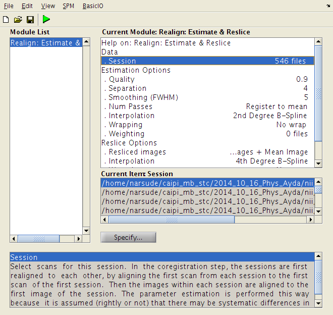
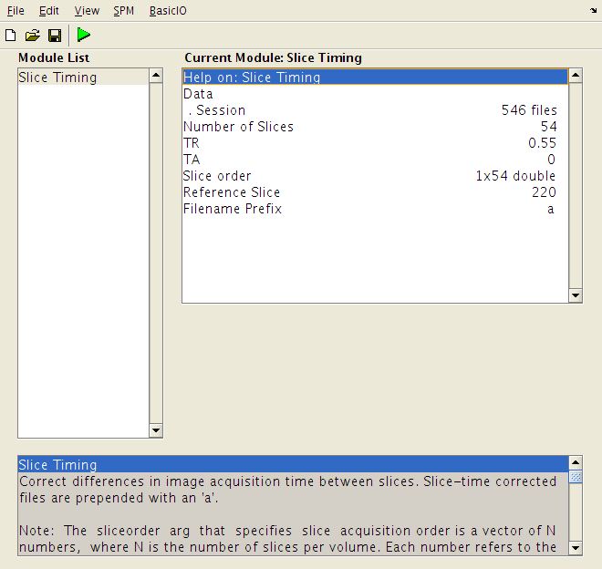
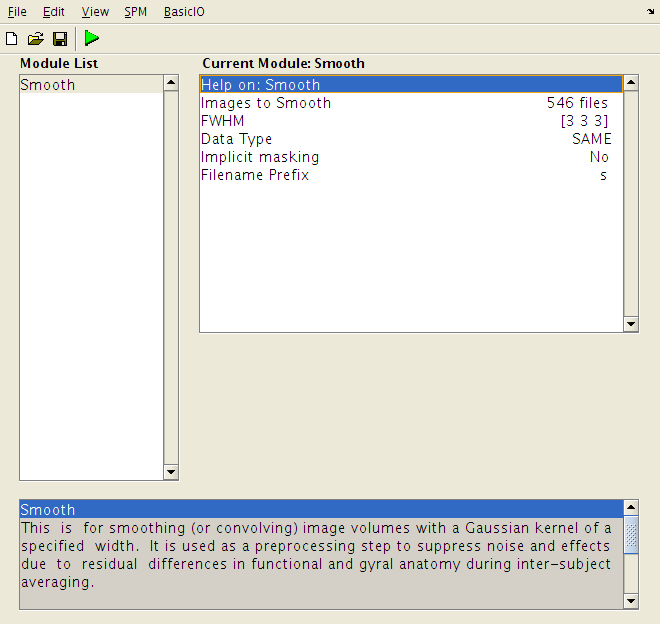
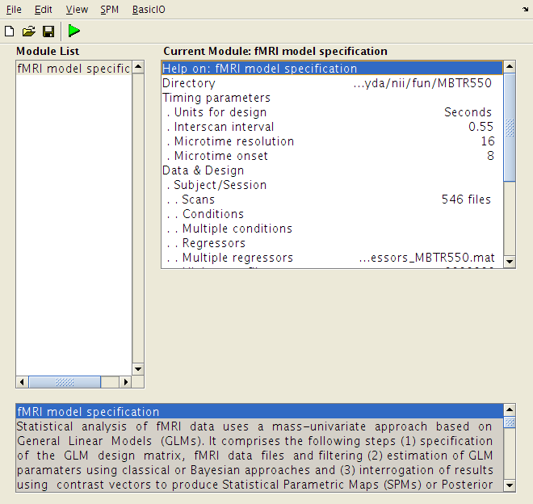
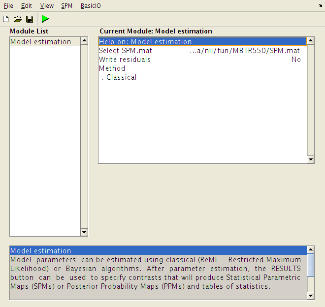

## SMS-EPI: Physiological noise characterization and correction using RETROICOR
---
### Data acquisition
---
Total of 6 subjects were scanned on a 7 Tesla (Siemens) scanner using a 32-channel (1 Tx, 32 Rx) head coil (Nova Inc.) using a [protocol](SMS-EPI.pdf) that resulted in volume TR of 550ms. The sequence SMS-EPI (a "wip" from Siemens) was run for 5 minutes per subject and subjects were asked to stay relaxed with their eyes open.

Concurrent to the MRI data acquisition, cardiac and respiratory signals were recorded using a pulse oxymeter and respiratory belt. These signals were sampled at 50Hz. The trigger for external pulse was recorded at 200Hz which helps in determining exact start of each volume acquisition. 

---
### Regressor creation
---
The MATLAB script _regressor\_creation.m_ creates a _.mat_ file which contains various regressors which we are taking into account during physiological noise characterization for functional MRI signal. 

> It is worth noting that the `repetition time` (TR) used for the scanning is separately calculated inside the script _regressor\_creation.m_ using extrenal triggers recorded during [data acquisition](#data-acquisition) step.  It is more correct to use this TR than nominal TR prescribed during scanning on the host computer. Not just for [regression creation](#regressor-creation) part, but for the entire data processing pipeline below.  

The regressors created are:

* 3 slow-drift regressors (rD)
	* We are using polynomials unto 3 degrees to characterize slow drifts due to scanner instabilities/ _He_ pressure build-up during EPI run. 
	* These regressors are de-meaned.
* 6 motion regressors (rM)
	* These are obtained from the motion parameters obtained after the image realignment step using SPM. These parameters are stored in a text file _rp\_<datasetName\>.txt_ file. The file is created in the same folder where dataset is located.
	* These regressors are de-meaned and de-trended.
* 8 RETROICOR regressors (rRETc, rRETr)
	* These RETROICOR regressors for cardiac and respiratory signals (4 regressors each) are created using _RETROICOR\_bianciardi2009i.m_ function impleted in MATLAB.
	* These regressors are de-meaned and de-trended.
* 1 cardiac rate regressor (CR)
	* This regressor is created using _CR\_Chang2009i.m_ function impleted in MATLAB.
	* This regressors is de-meaned and de-trended.
* 1 respiratory volume per unit time regressor (RVT)
	* This regressor is created using _RVT\_birn2008.m_ function impleted in MATLAB.
	* This regressors is de-meaned and de-trended. 
> I obtained MATLAB functions to create regressors from Wietske and Joao and do not know if it is okay to share these codes publically. Hence, not posting the files on github.

So we have total of 19 regressors and 1 more (baseline) gets added by the [SPM][SPM] during [model specification](#model-specification-and-estimate).

All these 19 regressors are bundled up in a single _regressors\_<datasetName\>.mat_ file which can be fed to SPM during [model specification](#model-specification-and-estimate) stage later. The individual _.mat_ files are stored in the _physioLogs_ folders for each volunteer.

The developed regressors were selectively grouped with DM<sub>0</sub> (baseline model) in order to build six nested regression models for GLM analysis.

1. DM<sub>1</sub> = \[DM<sub>0</sub> r<sub>RETRc</sub>\]
2. DM<sub>2</sub> = \[DM<sub>0</sub> r<sub>RETRr</sub>\]
3. DM<sub>3</sub> = \[DM<sub>0</sub> r<sub>RETR</sub>\]
4. DM<sub>4</sub> = \[DM<sub>3</sub> r<sub>CR</sub>\]
5. DM<sub>5</sub> = \[DM<sub>3</sub> r<sub>RVT</sub>\]
6. DM<sub>6</sub> = \[DM<sub>3</sub> r<sub>CR</sub> r<sub>RVT</sub>\]

---
### Spatial pre-processing
---

* __Realigned__ the SMS-EPI datasets using [SPM][SPM].

	

* __Slice time correction__ is performed for SMS-EPI

	
	* `Number of slices` are 54.
	* `Multi-band factor` is 6.
	* `Volume TR` is 550ms and `number of volumes` is 546 in `total run time` of 5 minutes.
	* Unlike [SPM8][SPM8], [SPM12][SPM12] provides the ability to enter `slice ordering` in _ms_. The one used for this experiment was:

  		``` 
    	220 0   275	55	330	110	385	165	440	
    	220	0	275	55	330	110	385	165	440	
    	220	0	275	55	330	110	385	165	440	
    	220	0	275	55	330	110	385	165	440	
    	220	0	275	55	330	110	385	165	440	
    	220	0	275	55	330	110	385	165	440
  		```

  		> A slow moving tilting head experiment was performed to determine the order of the slice acquisition.
  		> Further dicom header is used to determine the _acquisitoin time_ for each segment. Look for the field `Private_0019_1029` in the dicom header.
  
	* `Reference slice` is also prescribed as 220ms.

* __Smoothing__ is applied using [SPM12][SPM12] with 3x3x3 `kernel size`
	

---
### Model specification and estimate
---
* __Specify 1st-level__

	
	* `Directory` is prescribed as the one which contains the dataset.
	* `Timing parameters`
		* `Units of design` is Seconds.
		* `Interscan interval` is 0.55.
		* `Microtime resolution` is accepted as default 16.
		* `Microtime onset` is accepted as default 8.
	* `Data & Design`
		* `Scans` are all the volumes which are end result of the [Spatial pre-processing](#spatial-pre-processing) steps above.
		* `Multiple regressors` consists of a MATLAB _.mat_ file with 19 regressors, as created in the [regressor creation](#regressor-creation) step above.
		* `High-pass filter` value is set to 9999999, which is cutoff value in Seconds, and hence high-pass filtering is assumed to be ineffective.
	* `Masking threshold` is set to 0.6. The default of 0.8 masked out few ventricle regions from the brain.
	> This step creates a model in a _SPM.mat_ file in the specified `Directory`.

* __Estimate__

	
	* `Select SPM.mat` needs the file which is output of the above (_Specify 1st-level_) step.
	> This step outputs the parameters estimation for the model as a series of _beta\_00XX.nii_ files. In our case, _XX_ = 01 to 20.

---
### Adjusted R<sup>2</sup> calculation (R<sup>2</sup><sub>adj</sub>)
---

The adjusted coefficient of determination (R<sup>2</sup><sub>adj</sub>) was calculated with MATLAB script _calcR2adj.m_.

* [SPM12][SPM12] applies a built in scaling (session specific grand mean scaling) to the raw data during parameters estimation. I could not find a way to tell [SPM12][SPM12] not to apply this scaling.
* Therefore, instead of reading the raw data directly ourselves (as realigned and smoothed data), we should use the file handle from `SPM.xY.VY`.
	For example, `Y = spm_get_data(SPM.xY.VY, [0 0 0]');`
* The estimated parameters (betas) are obtained after filtering and whitening  the design matrix and the raw data.
* Therefore, apply the filtering to the above data as
	`Y = spm_filter(SPM.xX.K, SPM.xX.W*Y); `

> If the raw data is processed as above, the scales of this "raw data" and "fitted data" using betas are the same. Else they are off by a factor which is session specific.

The R<sup>2</sup><sub>adj</sub> is calculated for different nested models and subsequently the percentage contribution of the raw data signal variations due to different regressors can be calculated by subtracting models' R<sup>2</sup><sub>adj</sub>. 

The physilogical correction is also performed in the same script _calcR2adj.m_ because saving different fitted models and then reopening them in another script introduces potential rounding errors. The fitted models are subtracted from the raw data which can provide us corrected raw data.

---
### Current state
---
The above corrected datasets when fed to melodic for resting state networks detection cause [FSL][FSL] to crash. The crash is at the time of `susan` program which is one of the intermediate step during ICA. The error that's shown is not very helpful in determining the exact cause of the crash. 


[SPM]: http://www.fil.ion.ucl.ac.uk/spm/software/download.html
[SPM8]: http://www.fil.ion.ucl.ac.uk/spm/software/spm8/
[SPM12]: http://www.fil.ion.ucl.ac.uk/spm/software/spm12/
[FSL]: (http://fsl.fmrib.ox.ac.uk/fsl/fslwiki/)